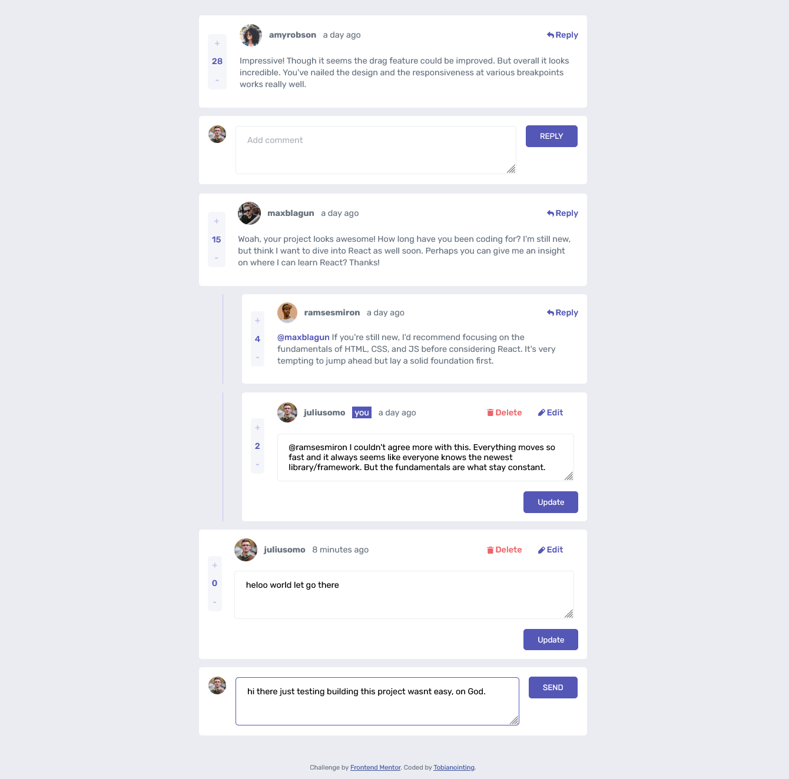
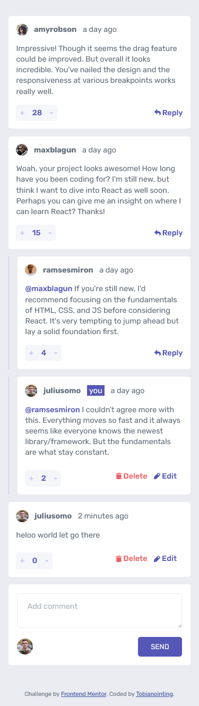

# Frontend Mentor - Interactive comments section solution

This is a solution to the [Interactive comments section challenge on Frontend Mentor](https://www.frontendmentor.io/challenges/interactive-comments-section-iG1RugEG9). Frontend Mentor challenges help you improve your coding skills by building realistic projects.

## Table of contents

- [Overview](#overview)
  - [The challenge](#the-challenge)
  - [Screenshot](#screenshot)
  - [Links](#links)
- [My process](#my-process)
  - [Built with](#built-with)
  - [What I learned](#what-i-learned)
  - [Continued development](#continued-development)
  - [Useful resources](#useful-resources)
- [Author](#author)


## Overview

### The challenge

Users should be able to:

- View the optimal layout for the app depending on their device's screen size
- See hover states for all interactive elements on the page
- Create, Read, Update, and Delete comments and replies
- Upvote and downvote comments
- **Bonus**: If you're building a purely front-end project, use `localStorage` to save the current state in the browser that persists when the browser is refreshed.
- **Bonus**: Instead of using the `createdAt` strings from the `data.json` file, try using timestamps and dynamically track the time since the comment or reply was posted.

### Screenshot





### Links

- Solution URL: [Source code](https://github.com/tobianointing/interactive-comments)
- Live Site URL: [Live site URL](https://interactive-commentsv2-35fhf58bd-tobianointing.vercel.app/)

## My process

### Built with

- Semantic HTML5 markup
- CSS custom properties
- Flexbox
- CSS Grid
- Mobile-first workflow
- [Typescript](https://www.typescriptlang.org/)
- [React](https://reactjs.org/) - JS library
- [Next.js](https://nextjs.org/) - React framework


### What I learned


-  Using CSS grid to build a responsive layout and design. Learnt more above CSS grid. 
- I learnt how to use the dayjs(JavaScript library for formatting date) to display the time from now on for each comment in a readable way.
- I learnt how to extend interfaces in typescript and at the same time omitting a type that's not needed in the extended interface
- I learnt how to write a structural and modular code using custom hooks in reactjs this makes my code much cleaner


```css
.comment {
  display: grid;
  grid-template-columns: auto minmax(0, auto);
  grid-template-areas:
    "header edit-btn"
    "body body"
    "counter btns";
  color: hsl(211, 10%, 45%);
  font-weight: 400;
  font-size: .9rem;
}
```
```js
import React, { useState } from "react"
import { DataCommentNode, DataNode, DataReply } from "../lib/interfaces/allInterfaces"

export const useHandleCommentOrReply = (data: DataNode, setData: React.Dispatch<any>) => {
  const [text, setText] = useState("")

  const handleChange: React.ChangeEventHandler<HTMLTextAreaElement> = (e) => {
    setText(e.target.value)
  }

  const handleSubmit = (args: {
    addTextType: string
    username?: string
    id?: number
    repliesLength?: number
  }) => {
    let comments: DataCommentNode[]

    if (text) {
      if (args.addTextType === "reply") {
        const newReply = {
          id: (args?.repliesLength || 0) + 1,
          content: text,
          createdAt: new Date().toISOString(),
          score: 0,
          user: data.currentUser,
          replyingTo: args?.username || "",
        }

        comments = [...data.comments].map((obj) => {
          if (obj.id === args.id) {
            return {
              ...obj,
              replies: [...obj.replies, newReply],
            }
          }

          return obj
        })
      } else {
        const newComment = {
          id: data.comments.length + 1,
          content: text,
          createdAt: new Date().toISOString(),
          score: 0,
          user: data.currentUser,
          replies: [],
        }

        comments = [...data.comments, newComment]
      }

      setData((prevState: DataNode) => ({
        ...prevState,
        comments: comments,
      }))

      setText("")
    }
  }

  return { text, handleChange, handleSubmit }
}

```


### Continued development

- I planned on learning my own implementation of time to now format in readable form e.g 2 days ago in pure javascript without any library.
- I planned on adding a backend to the projects using Python(Django) in order to store the data in a database and make the comments in real time.


### Useful resources

- [Time from now](https://day.js.org/) - This helped me to return the string of relative time from now e.g 2 days ago. I really liked this library. It is lightweight and comprehensive, just 2kb and will use it going forward.
- [Sort Array by ISO 8601 date](https://stackoverflow.com/questions/12192491/sort-array-by-iso-8601-date) - This helped me to sort array of objects by ISO 8601 date. I really liked this approach and will use it going forward.
- [Override the Type of an Interface property in TypeScript](https://bobbyhadz.com/blog/typescript-override-interface-property) - This is an amazing article which helped me finally understand how to override the type of an interface property in TypeScript. I'd recommend it to anyone still learning this concept.

- [The Definitive Guide to DateTime Manipulation](https://www.toptal.com/software/definitive-guide-to-datetime-manipulation) - This is an amazing article which helped me finally understand how to manipulate datetime in javascript. I'd recommend it to anyone still learning this concept.

## Author

- Website - [Tobianointing](https://tobianointing.github.io)
- Frontend Mentor - [@Tobianointing](https://www.frontendmentor.io/profile/Tobianointing)
- Twitter - [@elementkayode](https://www.twitter.com/elementkayode)

